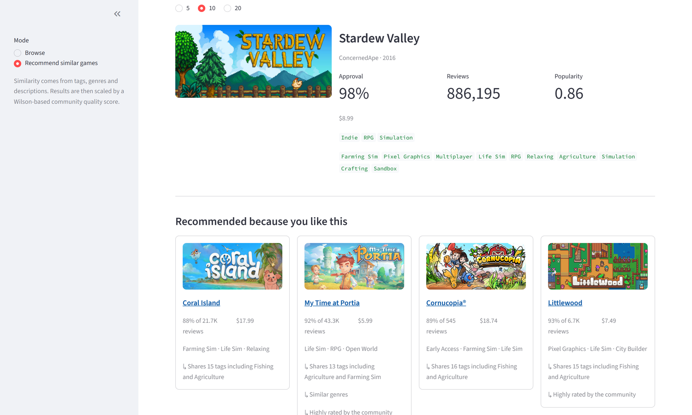
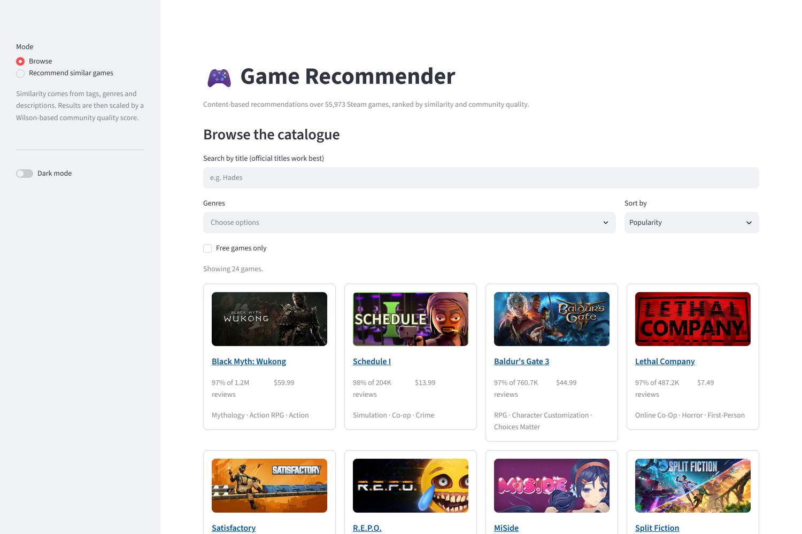
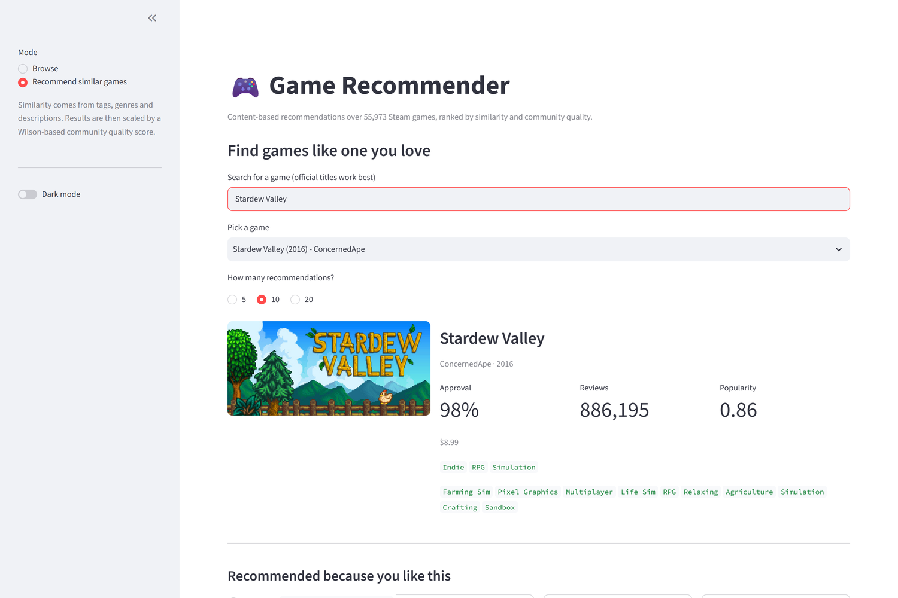
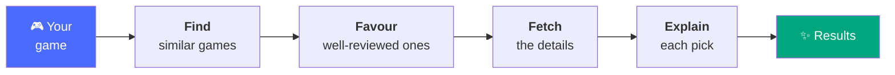

# 🎮 Game Recommender

**Tell it a game you love. It finds you more — and explains why.**

[](https://www.python.org/)



---

## What is this?

Steam has more than 125,000 games, and finding your next one usually means
scrolling past the same handful of bestsellers. If you just finished something
you loved, the question you actually want answered is simple: *what else is
like this?*

This app answers it. Pick a game you enjoyed and it finds others that genuinely
resemble it, based on their tags, genres and descriptions rather than on what
happens to be selling this week. Every recommendation comes with a short reason,
so you can tell at a glance why it showed up:

> **My Time at Portia** — Shares 13 tags including Agriculture and Farming Sim ·
> Similar genres · Highly rated by the community

There's also a browse mode for wandering through the catalogue by genre, price
or rating. Everything runs on your own machine — one command with Docker, no
account, no API keys, no sign-up.

---

## Features

| | |
|---|---|
| 🎯 **Find similar games** | Pick any game, get 5, 10 or 20 recommendations |
| 💬 **Clear reasons** | Every result explains itself in a line or two |
| 🔍 **Browse and search** | Filter by genre, sort by rating, price or release date |
| ⭐ **Quality first** | Well-reviewed games are favoured, so results aren't padded with shovelware |
| 🖼️ **Proper game cards** | Cover art, ratings, price and tags at a glance |
| 🐳 **One command to run** | `docker compose up` and you're going |

---

## Screenshots

**Browse** — search, filter and sort your way through the catalogue. Open it
with no filters and you get the best-reviewed games as a starting point.



**Find similar games** — start typing a title, pick it, and see what's like it.



---

## How it works


When you pick a game, it goes through four steps:



Similarity comes from three things a game tells you about itself — its tags, its
genres, and its store description — compared separately and then blended. Keeping
them apart is what lets each recommendation say *which* of them matched.

---

## Tech stack

| | |
|---|---|
| **Language** | Python 3.11+ |
| **Machine learning** | scikit-learn, scipy, numpy, pandas |
| **API** | FastAPI |
| **Interface** | Streamlit |
| **Database** | SQLite |
| **Packaging** | Docker |

---

## Quick start

```bash
docker compose up          # UI at localhost:8501, API at localhost:8000/docs
```

A 600-game sample is built into the image, so this works straight from a fresh
clone — nothing to download, nothing to configure.

<details>
<summary><b>Prefer to run it without Docker?</b></summary>

```bash
pip install -r requirements-dev.txt
python -m recommender.build --sample    # takes a few seconds
uvicorn api.main:app --reload           # localhost:8000
streamlit run app/main.py               # localhost:8501
```

To use the full catalogue of 55,973 games, download the
[Steam Games Dataset](https://www.kaggle.com/datasets/fronkongames/steam-games-dataset)
to `data/raw/games.csv`, then run `python -m recommender.build`. It takes about a
minute.

</details>

---

## Repository structure

```
recommender/     the recommendation engine — a plain Python library
api/             FastAPI endpoints
app/             the Streamlit interface
evaluation/      scripts for measuring recommendation quality
tests/           the test suite
data/sample/     600-game sample, so the project runs out of the box
docs/            engineering notes and screenshots
```

---

## Future work

- **Better handling of long series** — ask for games like Assassin's Creed and
  you currently get rather a lot of Assassin's Creed
- **Build a taste profile from several games** instead of just one
- **Smarter description matching** for games with unusual or very short blurbs
- **Support for non-English descriptions**, which are handled poorly today
- **Keep the catalogue fresh** so new releases appear without a manual rebuild

---

*A portfolio project, built to be readable and easy to reason about.*
