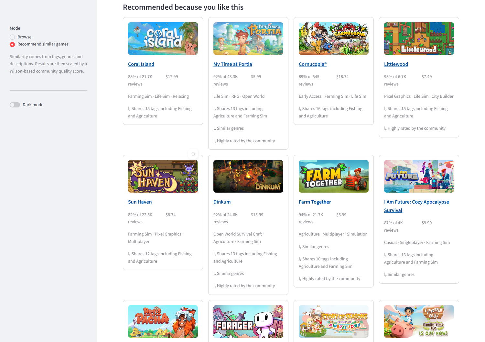
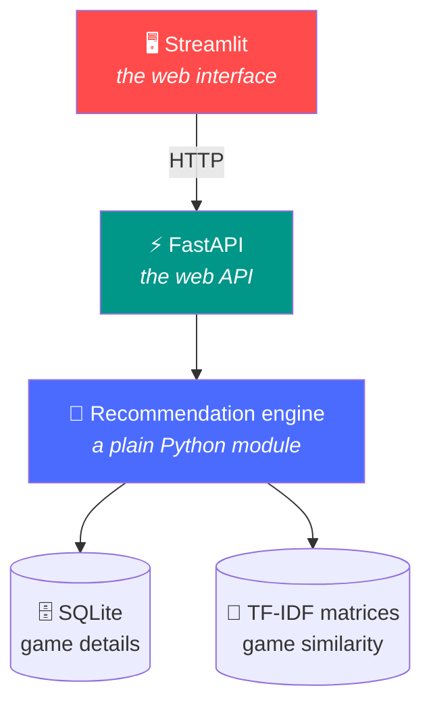
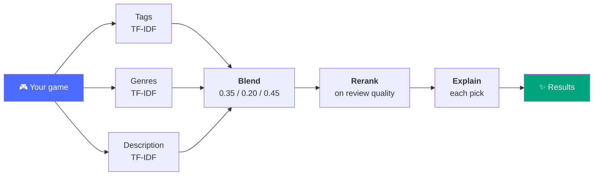

# 🎮 Game Recommender

**Tell it a game you love. It finds you more — and explains why.**

[](https://www.python.org/)


---

## What is this?

Steam has more than 125,000 games, and finding your next one usually means
scrolling past the same handful of bestsellers. If you just finished something
you loved, the question you actually want answered is simple: *what else is
like this?*

This app answers it. Pick a game you enjoyed and it finds others that genuinely
resemble it, based on their tags, genres and descriptions rather than on what
happens to be selling this week. Every recommendation comes with a short reason,
so you can tell at a glance why it showed up:

> **My Time at Portia** — Shares 13 tags including Agriculture and Farming Sim ·
> Similar genres · Highly rated by the community

There's also a browse mode for wandering through the catalogue by genre, price
or rating. Everything runs on your own machine — one command with Docker, no
account, no API keys, no sign-up.

---

## Features

| | |
|---|---|
| 🎯 **Find similar games** | Pick any game, get 5, 10 or 20 recommendations |
| 💬 **Clear reasons** | Every result explains itself in a line or two |
| 🔍 **Browse and search** | Filter by genre, sort by rating, price or release date |
| ⭐ **Quality first** | Well-reviewed games are favoured, so results aren't padded with shovelware |
| 📊 **Measured, not guessed** | Precision, Recall, MAP and NDCG against a held-out test set |
| 🐳 **One command to run** | `docker compose up` and you're going |

---

## Screenshots

**Browse** — search, filter and sort your way through the catalogue. Open it
with no filters and you get the best-reviewed games as a starting point.


**Find similar games** — start typing a title, pick it, and see what's like it.


**The recommendations** — 5, 10 or 20 games, each with a line or two saying why
it's there.



---

## Quick start

```bash
docker compose up          # UI at localhost:8501, API at localhost:8000/docs
```

A 600-game sample is built into the image, so this works straight from a fresh
clone — nothing to download, nothing to configure.

<details>
<summary><b>Prefer to run it without Docker?</b></summary>

Activate your virtual environment first:

```bash
.\venv\Scripts\activate          # Windows
source .venv/bin/activate        # macOS / Linux
```

Then install, build the catalogue, and start the two processes:

```bash
pip install -r requirements-dev.txt
python -m app.build --sample                    # or omit --sample for all 125k games
```

```bash
uvicorn app.api:app --reload                    # terminal 1
streamlit run frontend/streamlit_app.py         # terminal 2
```

Open **http://localhost:8501** in your browser.

</details>

---

## How it works



### The recommendation pipeline

Every game is described three separate ways, and each description gets its own
TF-IDF model. Keeping them apart is what lets a recommendation say *which* of
them matched.



1. **Three TF-IDF models.** Tags and genres are short controlled vocabularies;
   descriptions are prose. Putting them in one model lets the description drown
   out everything else.
2. **Blend.** Cosine similarity in each space, combined with tunable weights
   from `app/config.py`.
3. **Rerank.** Multiply by a community-quality score so well-reviewed games
   rise. The multiplier has a floor, so quality can reorder relevant games but
   can never promote an irrelevant one.
4. **Explain.** Name whichever model actually drove the score, and list the
   rarest tags the two games share.

Read `app/recommender.py` top to bottom and you have the whole algorithm.

---

## Evaluation

There is no user history in this dataset, so we make our own test set: **each
game's tags are split in half**, the models are built on one half and judged on
the other, which they never see. That keeps the recommender from marking its own
homework.

| metric | what it answers |
|---|---|
| **Precision@10** | Of what we showed, how much was relevant? |
| **Recall@50** | Of what was relevant, how much did we find? |
| **MAP@10** | Did the good results land near the top? |
| **NDCG@10** | Is the whole ranking in the right order? |

Alongside those we track diversity, novelty, how much of the page is badly
reviewed, and whether a game ever recommends itself.

The headline result: **three weighted models clearly beat squashing everything
into one**, and everything comfortably beats a popularity baseline.

Full tables in **[docs/results.md](docs/results.md)** — regenerate with
`python -m app.evaluate`.

---

## Dataset

[Steam Games Dataset](https://www.kaggle.com/datasets/fronkongames/steam-games-dataset)
— roughly 125,000 games scraped from the Steam store: titles, descriptions,
tags, genres, prices, platforms and review counts.

We keep **55,973 of them**. A game needs at least 10 reviews, some tags, and a
description of 20 words or more. That sounds like a popularity filter but isn't:
games with no reviews have tags less than 1% of the time, so there is simply
nothing to recommend them on.

⚠️ **The published CSV header is broken** — it lists 39 column names for rows
that have 40 values, so every column past the seventh is labelled with its
neighbour's name. Read naively, "description" fills up with DLC counts. See
[docs/ENGINEERING.md](docs/ENGINEERING.md#the-dataset-header-is-malformed).

The repo ships a 600-game sample, so everything runs without the 400 MB download.

---

## Tech stack

| | |
|---|---|
| **Language** | Python 3.11+ |
| **Machine learning** | scikit-learn, scipy, numpy, pandas |
| **API** | FastAPI |
| **Interface** | Streamlit |
| **Database** | SQLite |
| **Testing** | pytest |
| **Packaging** | Docker |

---

## Repository structure

```
app/
    config.py         every number you can tune
    build.py          raw CSV -> cleaned catalogue -> SQLite + TF-IDF matrices
    database.py       the SQLite catalogue: building it and querying it
    recommender.py    the recommendation engine
    explain.py        turning scores into readable reasons
    api.py            FastAPI endpoints
    evaluate.py       the evaluation harness and its metrics
frontend/
    streamlit_app.py  the whole user interface
tests/                pytest suite
docs/                 engineering notes, results, screenshots
data/sample/          600-game sample, so the project runs out of the box
```

---

## Testing

```bash
pytest
```

62 tests over the sample dataset, in about three seconds. They cover the things
that actually broke at some point: the malformed CSV header, games recommending
themselves, duplicate re-releases, the search index, and whether an explanation
is backed by the score that produced it.

---

## Future work

- **Better handling of long series** — ask for games like Assassin's Creed and
  you currently get rather a lot of Assassin's Creed
- **Build a taste profile from several games** instead of just one
- **BM25 for descriptions**, which handles long text better than plain TF-IDF
- **Learn the blend weights** instead of sweeping them by hand
- **Support for non-English descriptions**, which are handled poorly today
- **Keep the catalogue fresh** so new releases appear without a manual rebuild

More detail, and the experiments that were tried and rejected, in
**[docs/ENGINEERING.md](docs/ENGINEERING.md)**.

---

*A portfolio project, built to be readable and easy to reason about.*
